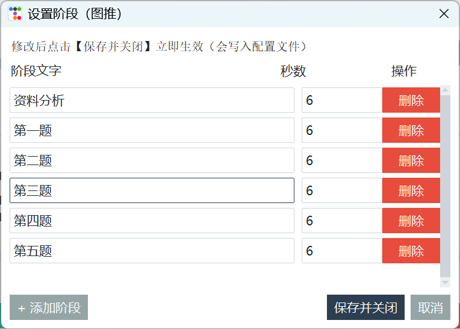
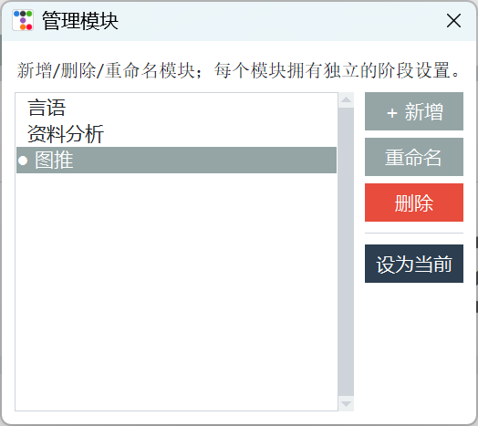

# 做题计时器

一个面向刷题、考试训练和分阶段任务练习的桌面计时器。项目使用 Python + Tkinter 构建界面，通过 `ttkbootstrap` 提供主题样式，并使用 `pyttsx3` 在阶段切换时进行语音提醒。

## 界面预览






## 功能特点

- 阶段式计时：可为“读题阶段”“第一题”“第二题”等任务阶段分别设置倒计时。
- 多模块管理：支持新增、删除、重命名模块，每个模块可以拥有独立的阶段配置。
- 阶段编辑：可修改阶段名称和秒数，也可以添加或删除阶段。
- 语音提醒：阶段结束后自动播报下一个阶段名称。
- 配置持久化：修改后的模块和阶段会写入配置文件，下次打开自动加载。
- 桌面应用打包：项目包含 PyInstaller 配置，可打包为 Windows 可执行程序。

## 技术栈

- Python 3
- Tkinter
- ttkbootstrap
- pyttsx3
- PyInstaller

## 项目结构

```text
Timer/
├── timer_app.py          # 主程序入口
├── requirements.txt      # Python 依赖
├── Timer_first.spec      # PyInstaller 打包配置
├── 计时器.ico             # 应用图标
├── 使用界面.png           # 界面截图
├── 每种任务的内部计时.png  # 阶段设置截图
├── 设置不同任务.png        # 模块管理截图
└── README.md
```

## 本地运行

在 Windows PowerShell 中执行：

```powershell
python -m venv .venv
.\.venv\Scripts\pip install -r requirements.txt
.\.venv\Scripts\python timer_app.py
```

如果已经创建过虚拟环境，只需要执行：

```powershell
.\.venv\Scripts\python timer_app.py
```

## 配置文件

默认情况下，程序会把用户配置保存到：

```text
%APPDATA%\ZuotiTimer\config.json
```

如果需要便携模式，可以在启动前设置环境变量：

```powershell
$env:TIMER_PORTABLE = "1"
.\.venv\Scripts\python timer_app.py
```

便携模式下，程序会优先读取和写入程序同目录下的 `config.json`。

## 打包为 EXE

安装 PyInstaller：

```powershell
.\.venv\Scripts\pip install pyinstaller
```

使用 spec 文件打包：

```powershell
.\.venv\Scripts\pyinstaller Timer_first.spec
```

也可以直接打包主程序：

```powershell
.\.venv\Scripts\pyinstaller --onefile --windowed --name Timer_first --icon "计时器.ico" timer_app.py
```

打包完成后，可执行文件通常会生成在 `dist/` 目录中。

## 提交到 GitHub

如果这是一个全新的 GitHub 仓库，可以按下面的流程提交。

1. 在本地初始化 Git 仓库：

```powershell
git init
git add .
git commit -m "Initial commit"
```

2. 在 GitHub 上新建一个空仓库，不要勾选自动生成 README、`.gitignore` 或 License。

3. 复制新仓库地址，例如：

```text
git@github.com:你的用户名/Timer.git
```

4. 关联远程仓库并推送：

```powershell
git branch -M main
git remote add origin git@github.com:你的用户名/Timer.git
git push -u origin main
```

推送完成后，刷新 GitHub 仓库页面即可看到项目文件。

## License

如果准备开源，建议补充一个许可证文件，例如 MIT License。
